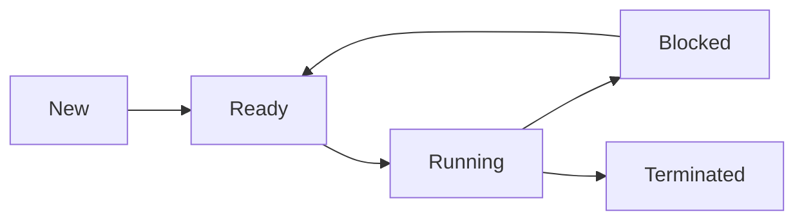
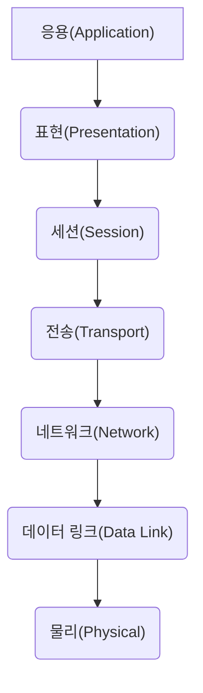
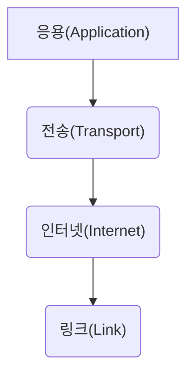
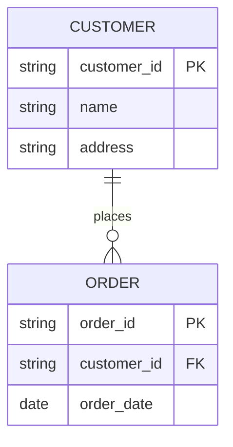

### 1. 운영체제 (OS)

#### 1.1. OS의 역할 및 기능

*   **역할**: 하드웨어 자원 관리, 추상화, 사용자 인터페이스 제공, 응용 프로그램 실행 환경 제공
*   **핵심 기능**: 프로세스 관리, 메모리 관리, 파일 관리, 입출력 관리, 보안 관리

#### 1.2. 프로세스 & 스레드

*   **프로세스**: 실행 중인 프로그램의 인스턴스, 독립적인 메모리 공간 및 자원 보유. PCB (Process Control 
Block)를 통해 관리.
*   **스레드**: 프로세스 내에서 실행되는 작업 단위, 프로세스 내 메모리 공간 공유. Context Switching 비용 감소.
*   **프로세스 vs 스레드:**

| 특징        | 프로세스                                  | 스레드                                   |
|-------------|-------------------------------------------|------------------------------------------|
| 자원        | 독립적인 자원 (메모리, 파일 등)          | 프로세스 내 자원 공유                      |
| 생성/삭제 비용 | 높음                                      | 낮음                                      |
| Context Switching | 높음                                      | 낮음                                      |
| 통신        | IPC (Inter-Process Communication) 필요 | 프로세스 내 공유 변수, 메시지 등으로 가능 |

*   **프로세스 상태:** 생성(New), 준비(Ready), 실행(Running), 대기(Blocked), 종료(Terminated)
*   **스케줄링 알고리즘:**
    *   **FCFS**: FIFO (First In First Out)
    *   **SJF**: Shortest Job First (최단 작업 우선. 비선점형)
    *   **Priority Scheduling**: 우선순위 높은 프로세스 우선 (선점형/비선점형)
    *   **Round Robin**: 타임 슬라이스 방식으로 프로세스 번갈아 실행 (선점형)
    *   **다단계 큐 스케줄링**: 여러 개의 큐를 사용, 큐마다 다른 스케줄링 알고리즘 적용.
    *   **다단계 피드백 큐 스케줄링**: 프로세스 우선순위 조정 가능.

#### 1.3. 메모리 관리

*   **주소 바인딩**: 논리 주소를 물리 주소로 변환하는 과정 (컴파일 시간, 런타임)
*   **가상 메모리**: 실제 메모리보다 큰 주소 공간 제공. 디스크 공간을 활용.
*   **페이지 테이블**: 가상 페이지와 물리 프레임의 매핑 정보. TLB (Translation Lookaside Buffer)를 통해 속도 향
상.
*   **페이지 교체 알고리즘**:
    *   **FIFO**: First In First Out
    *   **LRU**: Least Recently Used
    *   **Optimal**: 가장 사용하지 않을 페이지 교체 (이상적인 알고리즘)
    *   **LFU**: Least Frequently Used
*   **Thrashing**: 페이지 교체 횟수가 과도하게 발생하여 시스템 성능 저하. 워킹 셋(Working Set) 개념으로 해결.

#### 1.4. 파일 시스템

*   **파일 시스템 종류**: FAT, NTFS, ext4, APFS 등
*   **디렉토리 구조**: 트리 구조
*   **파일 접근 방식**: 순차 접근, 직접 접근, 색인 순차 접근

**Mermaid 다이어그램 (프로세스 상태):**

### 2. 네트워크

#### 2.1. OSI 7 계층

#### 2.2. TCP/IP 모델

*   **TCP vs UDP:**

| 특징        | TCP                                   | UDP                                  |
|-------------|---------------------------------------|--------------------------------------|
| 연결        | 연결 지향                             | 비연결 지향                            |
| 신뢰성       | 신뢰성 있는 데이터 전송                | 신뢰성 없음                           |
| 순서 보장     | 순서 보장                             | 순서 보장 X                          |
| 속도        | 상대적으로 느림                         | 상대적으로 빠름                        |
| 사용 예시     | 웹 브라우징, 파일 전송, 이메일           | 스트리밍, 온라인 게임, DNS           |

*   **IP 주소**: IPv4, IPv6, 서브넷 마스크, CIDR

#### 2.3. 네트워크 장비

*   라우터, 스위치, 허브, 방화벽, 로드 밸런서

#### 2.4. 네트워크 프로토콜

*   HTTP, FTP, SMTP, DNS, DHCP, SSH, TLS/SSL

### 3. 데이터베이스 (DB)

#### 3.1. DB 모델

*   계층적 모델, 네트워크 모델, 관계형 모델, 객체 지향 모델, NoSQL

#### 3.2. 관계형 DB

*   테이블, 릴레이션, 속성, 튜플
*   **키**: 기본 키 (Primary Key), 외래 키 (Foreign Key), 후보 키, 대체 키
*   **정규화**: 1NF, 2NF, 3NF, BCNF (데이터 중복 제거, 무결성 확보)
*   **SQL (Structured Query Language)**: SELECT, INSERT, UPDATE, DELETE, JOIN, GROUP BY, ORDER BY

#### 3.3. 트랜잭션

*   **ACID 속성**: Atomicity, Consistency, Isolation, Durability
*   **동시성 제어**:
    *   Locking: Shared Lock, Exclusive Lock
    *   Timestamping
    *   다중 버전 동시성 제어 (MVCC)

#### 3.4. NoSQL

*   Key-Value Store, Document DB, Column-Family DB, Graph DB

**Mermaid 다이어그램 (관계형 DB ERD 예시):**

---

**참고:**

*   이 자료는 정보처리 기사 시험 대비를 위한 심층적인 내용입니다.
*   각 항목에 대한 더 자세한 내용은 관련 서적이나 온라인 자료를 참고하시기 바랍니다.
*   실기 시험에서는 SQL 쿼리 작성 능력도 중요하므로, 꾸준히 연습하는 것이 좋습니다.
*   Mermaid 다이어그램은 텍스트 기반으로 그림을 생성하는 도구입니다.  온라인 Mermaid Live Editor 
([https://mermaid.live/](https://mermaid.live/)) 에서 직접 수정하고 확인할 수 있습니다.
